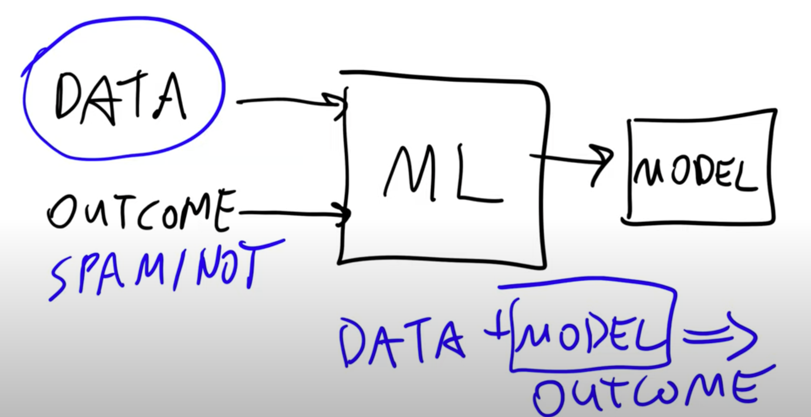
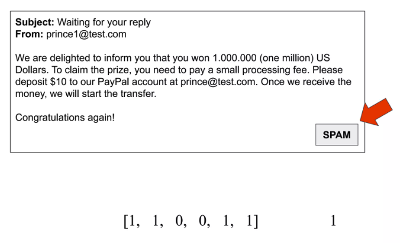
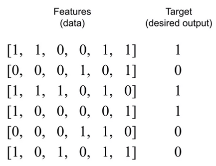
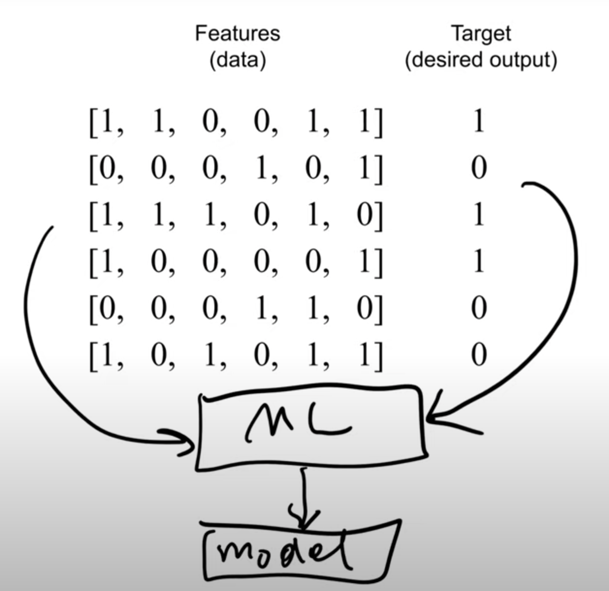
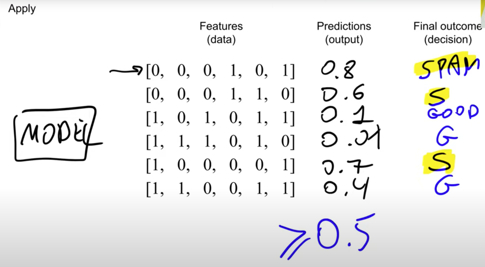

## 1.2 ML vs Rule-Based Systems

[Slides](https://www.slideshare.net/AlexeyGrigorev/ml-zoomcamp-12-ml-vs-rulebased-systems)

## Notes

The difference between ML and Rule-Based systems is explained with the example of a **spam filter**.

Traditional Rule-Based systems are based on a set of **characteristics** (keywords, email length, etc.) that identify an email as spam or not. As spam emails keep changing over time the system needs to be upgraded making the process untractable due to the complexity of code maintenance as the system grows.

ML can be used to solve this problem with the following steps:

### 1. Get data

Emails from the user's spam folder and inbox give examples of spam and non-spam.

### 2. Define and calculate features

Rules/characteristics from rule-based systems can be used as a starting point to define features for the ML model. The value of the target variable for each email can be defined based on where the email was obtained from (spam folder or inbox).

Each email can be encoded (converted) to the values of its features and target.

EX Features:

- Length of title > 10? true/false
- Length of body > 10? true/false
- Sender “promotions@online.com”? true/false
- Sender “hpYOSKmL@test.com”? true/false
- Sender domain “test.com”? true/false
- Description contains “deposit”? true/false

All of the six features here are binary features, so you can encode each mail as binary code like [1, 1, 0, 0, 1, 1]. Besides this every email has a label1 / target (spam = 1, no-spam = 0), which is the desired output.

### 3. Train and use the model

A machine learning algorithm can then be applied to the encoded emails to build a model that can predict whether a new email is spam or not spam.

The **predictions are probabilities**, and to make a decision it is necessary to define a threshold to classify emails as spam or not spam.

<table>
   <tr>
      <td>⚠️</td>
      <td>
         The notes are written by the community.  
         If you see an error here, please create a PR with a fix.
      </td>
   </tr>
</table>

- [Notes from Peter Ernicke](https://knowmledge.com/2023/09/10/ml-zoomcamp-2023-introduction-to-machine-learning-part-2/)

## Navigation

- [Machine Learning Zoomcamp course](../)
- [Lesson 1: Introduction to Machine Learning](./)
- Previous: [Introduction to Machine Learning](01-what-is-ml.md)
- Next: [Supervised Machine Learning](03-supervised-ml.md)
