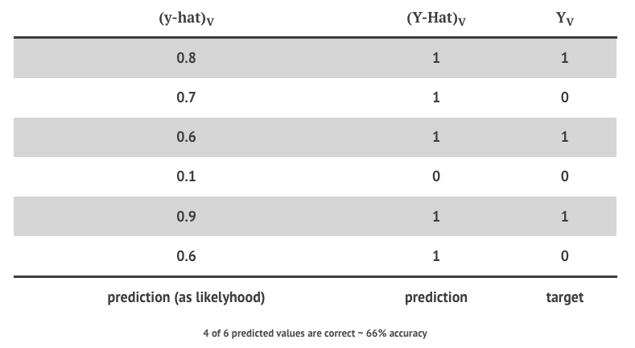
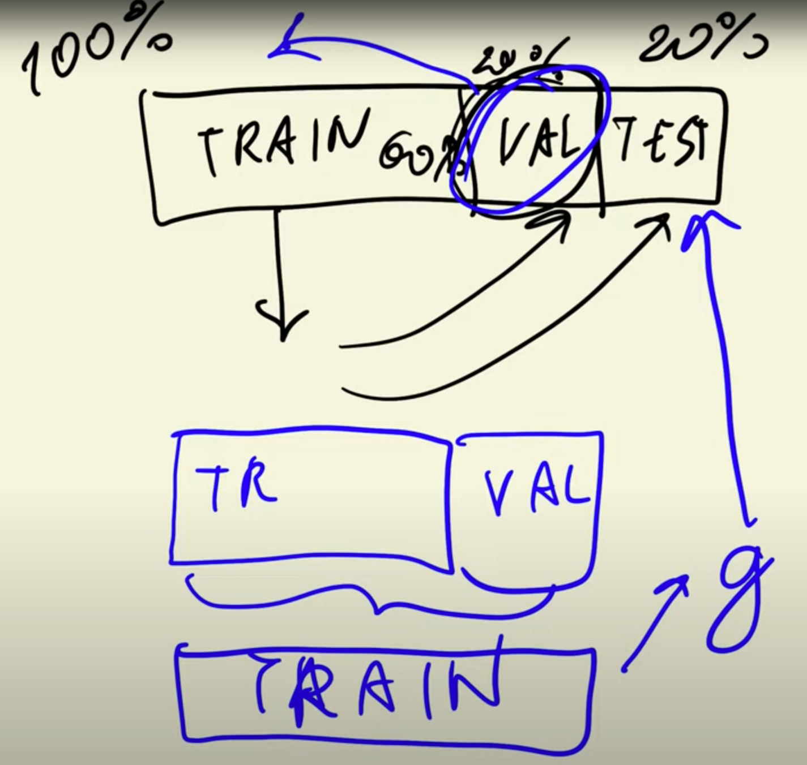

## 1.5 Model Selection Process

[Slides](https://www.slideshare.net/AlexeyGrigorev/ml-zoomcamp-15-model-selection-process)

## Notes

### Which model to choose?

- Logistic regression
- Decision tree
- Neural Network
- Or many others

The validation dataset is not used in training. There are feature matrices and y vectors for both training and validation datasets. The model is fitted with training data, and it is used to predict the y values of the validation feature matrix. Then, the predicted y values (probabilities) are compared with the actual y values.

- Extract feature matrix Xtrain from train dataset
- You also have the target value ytrain from train dataset
- Using Xtrain and ytrain to train g
- From validation dataset you also have XV and yV
- Applying g to XV to get predicted values: g(XV) = (y-hat)V
- Comparing the predicted (y-hat)V values with the actual yV values to get information about model performance

**Multiple comparisons problem (MCP):** just by chance one model can be lucky and obtain good predictions because all of them are probabilistic.

The test set can help to avoid the MCP. Obtaining the best model is done with the training and validation datasets, while the test dataset is used for assuring that the proposed best model is the best.

1. Split datasets in training, validation, and test. E.g. 60%, 20% and 20% respectively
2. Train the models
3. Evaluate the models
4. Select the best model
5. Apply the best model to the test dataset
6. Compare the performance metrics of validation and test

<u>NB:</u> Note that it is possible to reuse the validation data. After selecting the best model (step 4), the validation and training datasets can be combined to form a single training dataset for the chosen model before testing it on the test set.

Here are the steps for the alternative approach:

1. Split the original dataset into training, validation, and test sets with a ratio of 60%-20%-20%.
2. Train the initial models using the training dataset.
3. Apply the initial models to the validation dataset and evaluate their performance.
4. Select the best-performing model based on the validation results.
5. Combine the training and validation datasets to create a new combined dataset.
6. Retrain the selected model using the new combined dataset.
7. Apply the newly trained model to the test dataset to assess its performance on unseen data.

<table>
   <tr>
      <td>⚠️</td>
      <td>
         The notes are written by the community.  
         If you see an error here, please create a PR with a fix.
      </td>
   </tr>
</table>

- [Notes from Peter Ernicke](https://knowmledge.com/2023/09/13/ml-zoomcamp-2023-introduction-to-machine-learning-part-5/)

## Navigation

- [Machine Learning Zoomcamp course](../)
- [Lesson 1: Introduction to Machine Learning](./)
- Previous: [CRISP-DM](04-crisp-dm.md)
- Next: [Setting up the Environment](06-environment.md)
