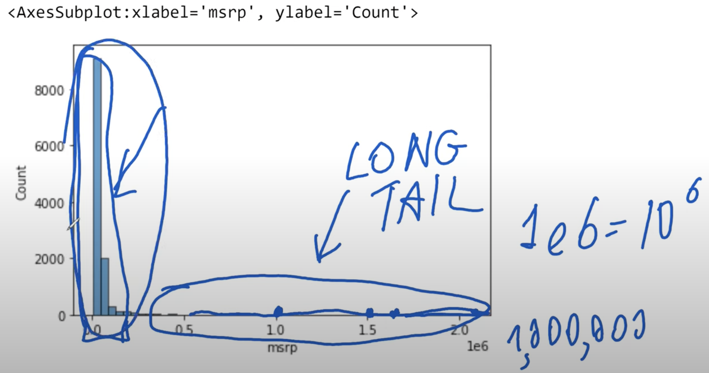
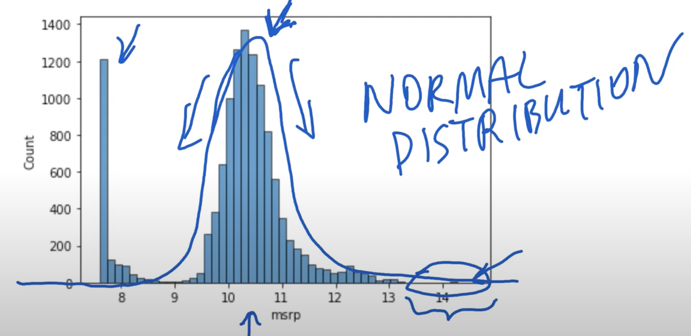

## 2.3 Exploratory data analysis

[Slides](https://www.slideshare.net/AlexeyGrigorev/ml-zoomcamp-2-slides)

## Notes

**Pandas attributes and methods:**

- `df[col].unique()` -> return a list of unique values in the series
- `df[col].nunique()` -> return the number of unique values in the series
- `df.isnull().sum()` -> return the number of null values in the dataframe

**Matplotlib and seaborn methods:**

- `%matplotlib inline` -> assure that plots are displayed in jupyter notebook's cells
- `sns.histplot()` -> show the histogram of a series

**Numpy methods:**

- `np.log1p()` -> apply log transformation to a variable, after adding one to each input value.

Long-tail distributions usually confuse the ML models, so the recommendation is to transform the target variable distribution to a normal one whenever possible.

`Quote from Note of Peter Ernicke`

### Distribution of price

This kind of distribution (long tail, and the peak) is not good for ML models, because this distribution will confuse them.There is a way to get rid of the long tail, by applying logarithm to the price. This results in more compact values.

In this problem, in order to get rid of this long tail, we apply the logarithm distribution -> get more compact values.

You can see the long tail is gone and you see a nice bell curve shape of a so called `normal distribution`, what is `ideal for ML models`. But still there is the strange peak. This could be the minimum price of $1000 of the platform.

### Missing values

As the title suggests, this is about finding missing values (NaN values). We can use the function in the following snippet to find that values. The sum function sums across columns and shows for each column how much missing values are there. This information is important when training a model.

The entire code of this project is available in [this jupyter notebook](https://github.com/alexeygrigorev/mlbookcamp-code/blob/master/chapter-02-car-price/02-carprice.ipynb).

<table>
   <tr>
      <td>⚠️</td>
      <td>
         The notes are written by the community.  
         If you see an error here, please create a PR with a fix.
      </td>
   </tr>
</table>

- [Notes from Peter Ernicke](https://knowmledge.com/2023/09/19/ml-zoomcamp-2023-machine-learning-for-regression-part-2/)

## Navigation

- [Machine Learning Zoomcamp course](../)
- [Session 2: Machine Learning for Regression](./)
- Previous: [Data preparation](02-data-preparation.md)
- Next: [Setting up the validation framework](04-validation-framework.md)
