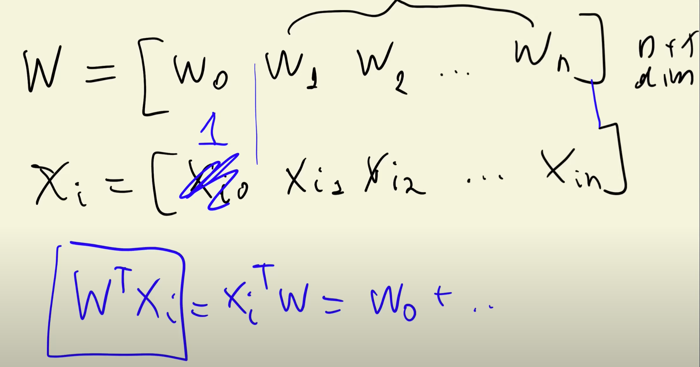
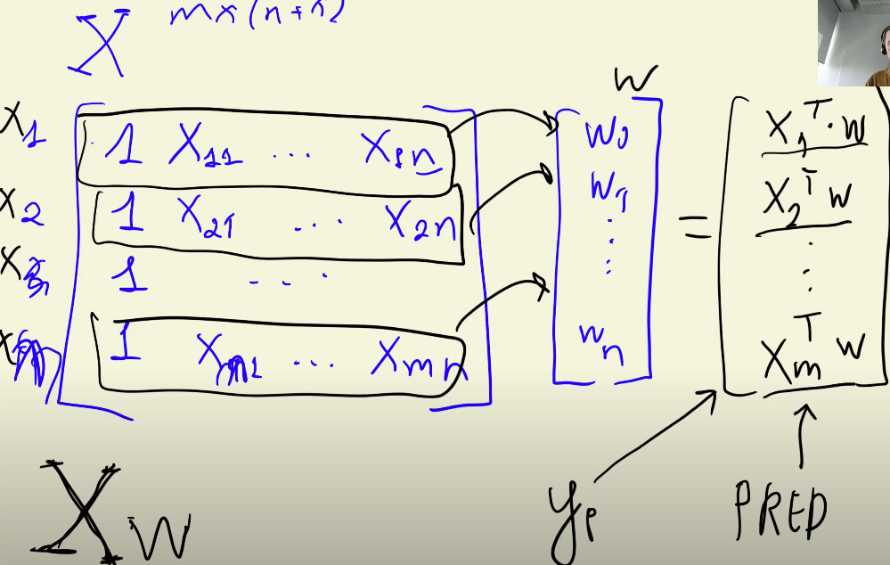

## 2.6 Linear regression: vector form

[Slides](https://www.slideshare.net/AlexeyGrigorev/ml-zoomcamp-2-slides)

## Notes

The formula of linear regression can be synthesized with the dot product between features and weights. The feature vector includes the _bias_ term with an _x_ value of one, such as $w_{0}^{x_{i0}},\ where\ x_{i0} = 1\ for\ w_0$.

When all the records are included, the linear regression can be calculated with the dot product between **_feature matrix_** and **_vector of weights_**, obtaining the `y` vector of predictions.

The entire code of this project is available in [this jupyter notebook](https://github.com/alexeygrigorev/mlbookcamp-code/blob/master/chapter-02-car-price/02-carprice.ipynb).

<table>
   <tr>
      <td>⚠️</td>
      <td>
         The notes are written by the community.  
         If you see an error here, please create a PR with a fix.
      </td>
   </tr>
</table>

- [Notes from Peter Ernicke](https://knowmledge.wordpress.com/2023/09/20/ml-zoomcamp-2023-machine-learning-for-regression-part-5/)

## Navigation

- [Machine Learning Zoomcamp course](../)
- [Session 2: Machine Learning for Regression](./)
- Previous: [Linear regression](05-linear-regression-simple.md)
- Next: [Training linear regression: Normal equation](07-linear-regression-training.md)
