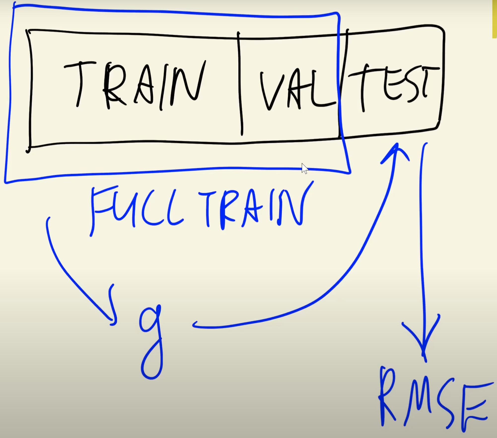

## 2.15 Using the model

[Slides](https://www.slideshare.net/AlexeyGrigorev/ml-zoomcamp-2-slides)

## Notes

After finding the best model and its parameters, it was trained with training and validation partitions and the final RMSE was calculated on the test partition.

Finally, the final model was used to predict the price of new cars (To get the real price we need to undo the logarithm). After that we make the final evaluation on the test dataset to make sure that our model works fine and check what is the value for RMSE. It shouldn’t be too different from what we saw on the validation dataset.

The entire code of this project is available in [this jupyter notebook](https://github.com/alexeygrigorev/mlbookcamp-code/blob/master/chapter-02-car-price/02-carprice.ipynb).

<table>
   <tr>
      <td>⚠️</td>
      <td>
         The notes are written by the community.  
         If you see an error here, please create a PR with a fix.
      </td>
   </tr>
</table>

- [Notes from Peter Ernicke](https://knowmledge.com/2023/09/24/ml-zoomcamp-2023-machine-learning-for-regression-part-12/)

## Navigation

- [Machine Learning Zoomcamp course](../)
- [Session 2: Machine Learning for Regression](./)
- Previous: [Tuning the model](14-tuning-model.md)
- Next: [Car price prediction project summary](16-summary.md)
