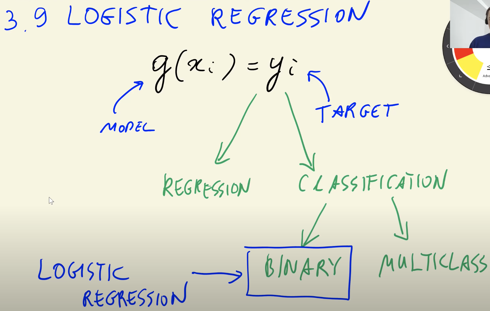
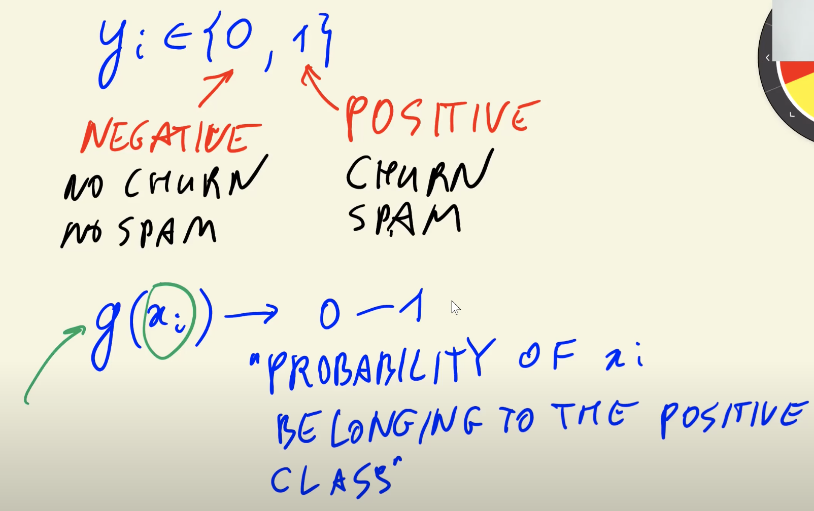
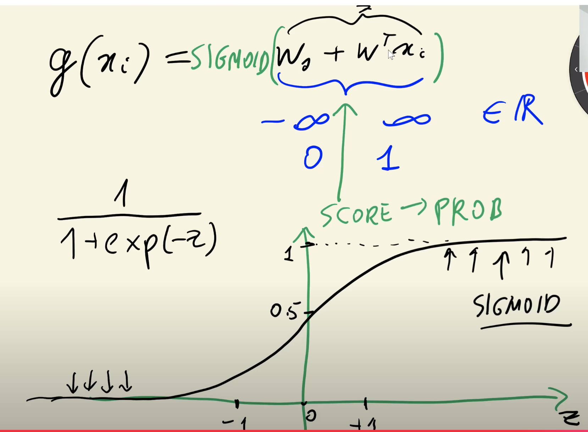

## 3.9 Logistic regression

[Slides](https://www.slideshare.net/AlexeyGrigorev/ml-zoomcamp-3-machine-learning-for-classification)

## Notes

In general, supervised models can be represented with this formula:

    $g(x_{i})$ = $y_{i}$

Depending on what is the type of target variable, the supervised task can be regression or classification (binary or multiclass). Binary classification tasks can have negative (0) or positive (1) target values. The output of these models is the probability of $x_i$ belonging to the positive class.

Logistic regression is similar to linear regression because both models take into account the bias term and weighted sum of features. The difference between these models is that the output of linear regression is a real number, while logistic regression outputs a value between zero and one, applying the sigmoid function to the linear regression formula.

### Linear rergression:

$g(x_{i})$ = $w_{0}$ + $w_{1}x_{1}$ + $w_{2}x_{2}$ + ... + $w_{n}x_{n}$ = $w_{0}$ + $w^{T}x_{i}$ ==> outpus a number $-\infty$ ... $\infty$

- $x_{0}$ – bias term
- $w^{T}$ – weights vector
- $x_{i}$​ – features

### Logistic regression:

$g(x_{i})$ = SIGMOID($w_{0}$ + $w^{T}x_{i}$) ==> outpus a number 0 ... 1

Sigmoid(z) = $\frac{1}{(1+ exp(-z))}$

In this way, the sigmoid function allows transforming a score into a probability.

The entire code of this project is available in [this jupyter notebook](https://github.com/alexeygrigorev/mlbookcamp-code/blob/master/chapter-03-churn-prediction/03-churn.ipynb).

<table>
   <tr>
      <td>⚠️</td>
      <td>
         The notes are written by the community.  
         If you see an error here, please create a PR with a fix.
      </td>
   </tr>
</table>

- [Notes from Peter Ernicke](https://knowmledge.com/2023/09/30/ml-zoomcamp-2023-machine-learning-for-classification-part-9/)

## Navigation

- [Machine Learning Zoomcamp course](../)
- [Session 3: Machine Learning for Classification](./)
- Previous: [One-hot encoding](08-ohe.md)
- Next: [Training logistic regression with Scikit-Learn](10-training-log-reg.md)
