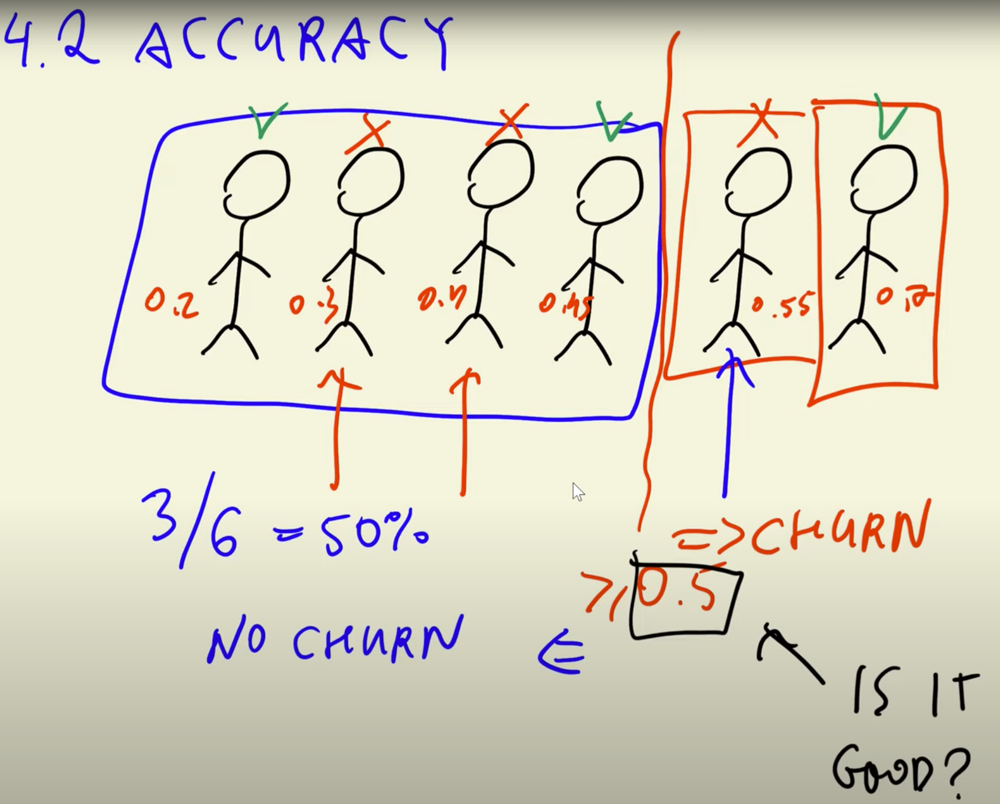

## 4.2 Accuracy and dummy model

[Slides](https://www.slideshare.net/AlexeyGrigorev/ml-zoomcamp-4-evaluation-metrics-for-classification)

## Notes

**Accuracy** measures the fraction of correct predictions. Specifically, it is the number of correct predictions divided by the total number of predictions.

We can change the **decision threshold**, it should not be always 0.5. But, in this particular problem, the best decision cutoff, associated with the hightest accuracy (80%), was indeed 0.5.

Note that if we build a **dummy model** in which the decision cutoff is 1, so the algorithm predicts that no clients will churn, the accuracy would be 73%. Thus, we can see that the improvement of the original model with respect to the dummy model is not as high as we would expect.

Therefore, in this problem accuracy can not tell us how good is the model because the dataset is **unbalanced**, which means that there are more instances from one category than the other. This is also known as **class imbalance**.

`Quote from Note of Peter Ernicke`

There is an important point about the limitations of accuracy as an evaluation metric. While we may achieve a certain level of accuracy, it doesn’t always provide the full picture of a model’s performance, especially in cases with imbalanced datasets or when specific types of errors are more critical than others.

In this example, I’ve mentioned that the accuracy of the model is 80%, but a dummy model that predicts all customers as not churning achieves an accuracy of 73%. This highlights the issue with accuracy, as it doesn’t differentiate between different types of errors. In churn prediction, false negatives (predicting a customer won’t churn when they actually do) can be more costly than false positives (predicting a customer will churn when they won’t).

Choosing the most appropriate evaluation metric depends on the specific goals and requirements of the problem. For example, in cases where minimizing false negatives is crucial (e.g., in medical diagnoses or fraud detection), recall may be a more relevant metric than accuracy.

In cases of class imbalance, the traditional accuracy metric can be misleading. For example, a dummy model that predicts the majority class for all samples can achieve a high accuracy simply by getting most of the samples right for the majority class. However, it will perform poorly in identifying the minority class (in this case, the churning customers), which is often more crucial to predict accurately.

To effectively address class imbalance and evaluate our model, we should consider alternative metrics such as:

- `Precision`: This metric measures the proportion of true positive predictions among all positive predictions. It is particularly useful when the cost of false positives is high.
- `Recall`: Recall measures the proportion of true positive predictions among all actual positive instances. It is valuable when the cost of false negatives is significant.
- `F1-Score`: The F1-Score is the harmonic mean of precision and recall, providing a balanced measure that considers both false positives and false negatives.
- `Area Under the Receiver Operating Characteristic Curve (AUC-ROC)`: The ROC curve plots the true positive rate against the false positive rate at various threshold settings. The AUC-ROC score assesses the classifier’s ability to distinguish between the positive and negative classes, making it particularly useful for imbalanced datasets.

Selecting the appropriate evaluation metric depends on the specific goals and requirements of the problem. In cases of class imbalance, accurate identification of the minority class (churning customers) is crucial.

**Classes and methods:**

- `np.linspace(x,y,z)` - returns a numpy array starting at `x` until `y` with `z` evenly spaced samples
- `Counter(x)` - collection class that counts the number of instances that satisfy the `x` condition
- `accuracy_score(x, y)` - sklearn.metrics class for calculating the accuracy of a model, given a predicted `x` dataset and a target `y` dataset.

The entire code of this project is available in [this jupyter notebook](notebook.ipynb).

Add notes from the video (PRs are welcome)

<table>
   <tr>
      <td>⚠️</td>
      <td>
         The notes are written by the community.  
         If you see an error here, please create a PR with a fix.
      </td>
   </tr>
</table>

- [Notes from Peter Ernicke](https://knowmledge.com/2023/10/03/ml-zoomcamp-2023-evaluation-metrics-for-classification-part-2/)

## Navigation

- [Machine Learning Zoomcamp course](../)
- [Session 4: Evaluation Metrics for Classification](./)
- Previous: [Evaluation metrics: session overview](01-overview.md)
- Next: [Confusion table](03-confusion-table.md)
