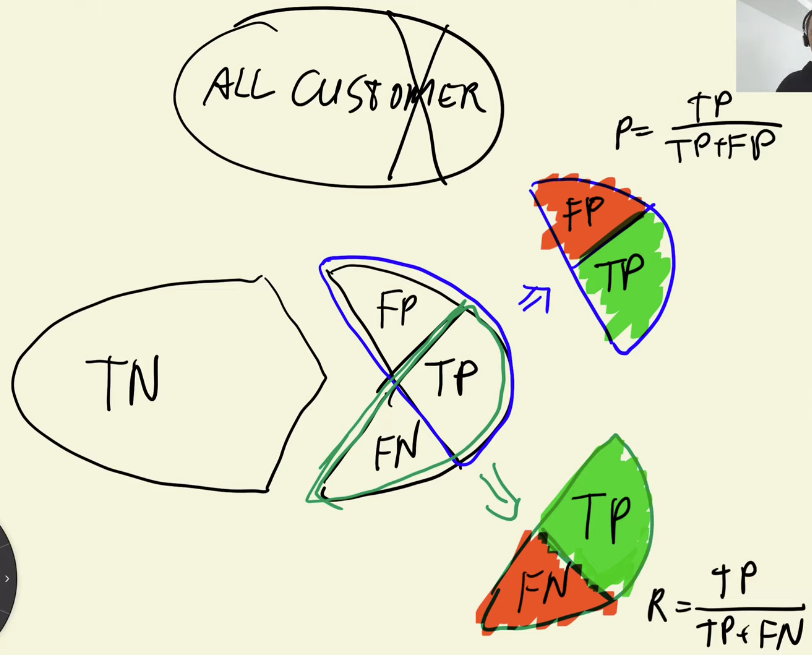
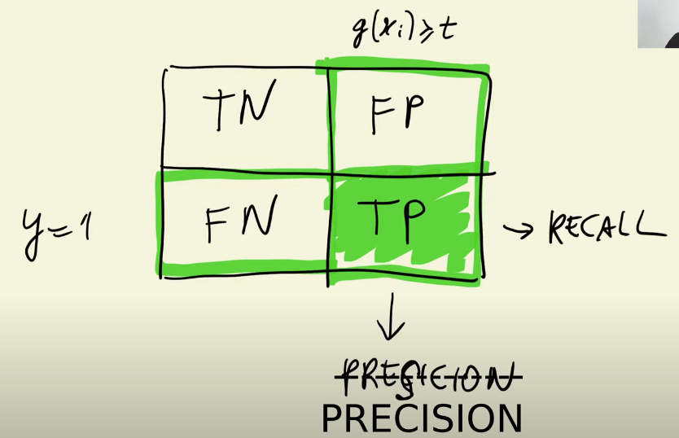
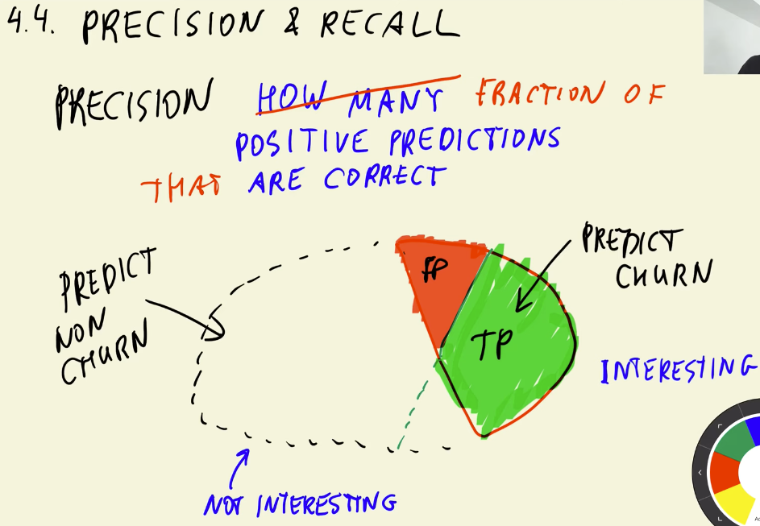
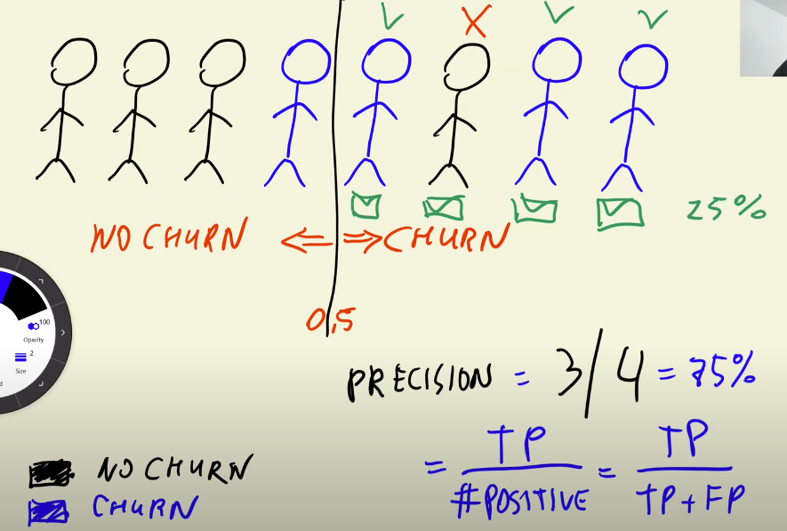
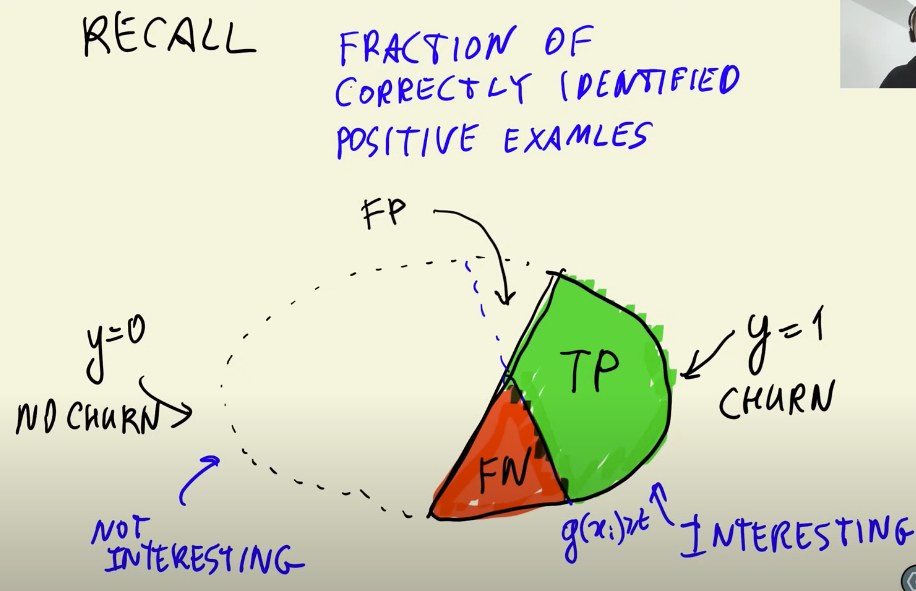
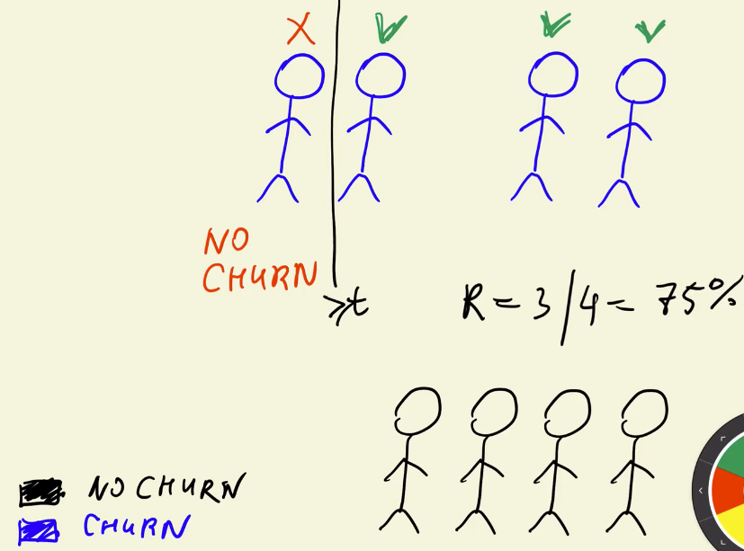
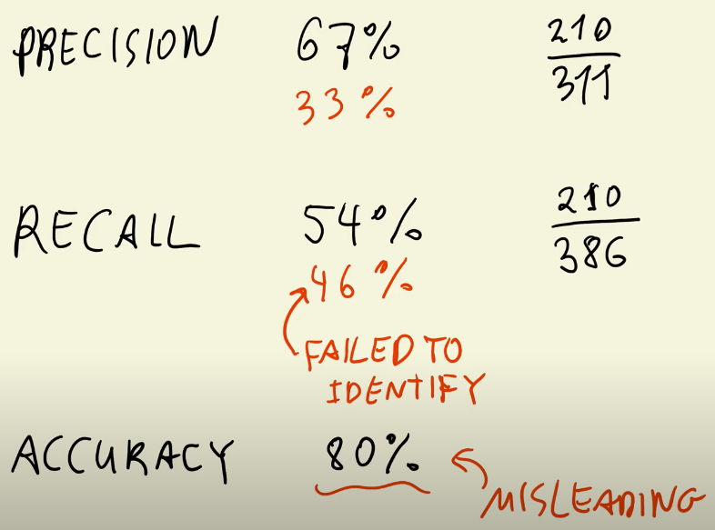

## 4.4 Precision and Recall

[Slides](https://www.slideshare.net/AlexeyGrigorev/ml-zoomcamp-4-evaluation-metrics-for-classification)

## Notes

**Precision** tell us the fraction of positive predictions that are correct. It takes into account only the **positive class** (TP and FP - second column of the confusion matrix), as is stated in the following formula:

$$P = \cfrac{TP}{TP + FP}$$

**Recall** measures the fraction of correctly identified postive instances. It considers parts of the **positive and negative classes** (TP and FN - second row of confusion table). The formula of this metric is presented below:

$$R = \cfrac{TP}{TP + FN}$$

In this problem, the precision and recall values were 67% and 54% respectively. So, these measures reflect some errors of our model that accuracy did not notice due to the `class imbalance`.

**MNEMONICS:**

- Precision : From the `pre`dicted positives, how many we predicted right. See how the word `pre`cision is similar to the word `pre`diction?

- Recall : From the `real` positives, how many we predicted right. See how the word `recall` is similar to the word `real`?

Add notes from the video (PRs are welcome)

<table>
   <tr>
      <td>⚠️</td>
      <td>
         The notes are written by the community.  
         If you see an error here, please create a PR with a fix.
      </td>
   </tr>
</table>

- [Notes from Peter Ernicke](https://knowmledge.com/2023/10/05/ml-zoomcamp-2023-evaluation-metrics-for-classification-part-4/)

## Navigation

- [Machine Learning Zoomcamp course](../)
- [Session 4: Evaluation Metrics for Classification](./)
- Previous: [Confusion table](03-confusion-table.md)
- Next: [ROC Curves](05-roc.md)
