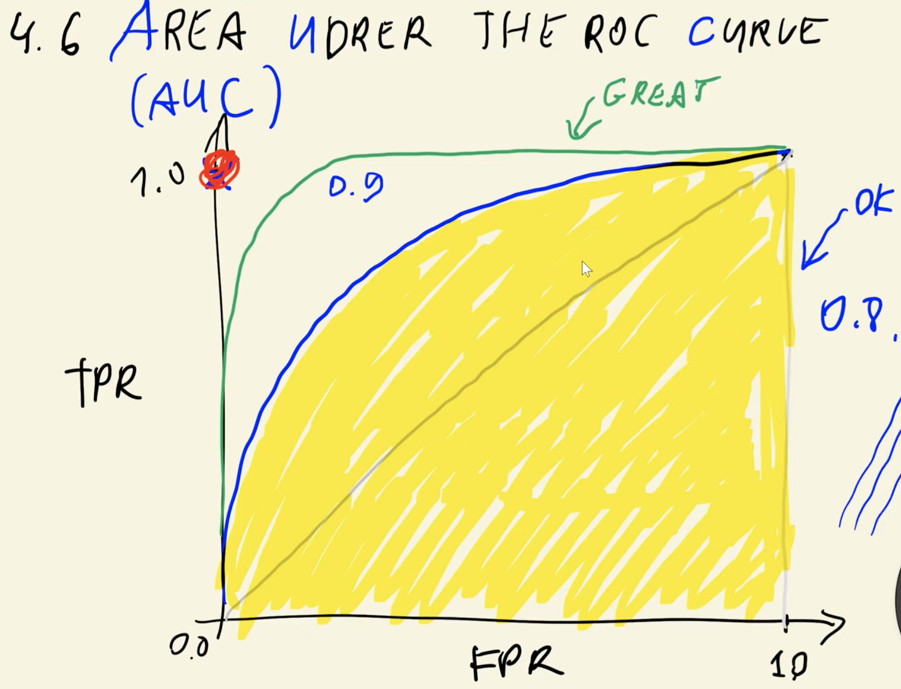
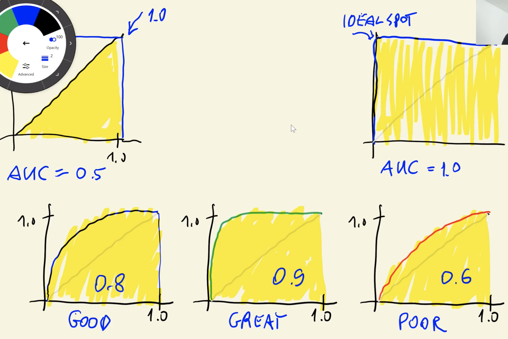

## 4.6 ROC AUC

[Slides](https://www.slideshare.net/AlexeyGrigorev/ml-zoomcamp-4-evaluation-metrics-for-classification)

## Notes

The Area under the ROC curves can tell us how good is our model with a single value. The AUROC of a random model is 0.5, while for an ideal one is 1.

In other words, AUC can be interpreted as the probability that a randomly selected positive example has a greater score than a randomly selected negative example.

**Classes and methods:**

- `auc(x, y)` - sklearn.metrics class for calculating area under the curve of the x and y datasets. For ROC curves x would be false positive rate, and y true positive rate.
- `roc_auc_score(x, y)` - sklearn.metrics class for calculating area under the ROC curves of the x false positive rate and y true positive rate datasets.
- `randint(x, y, size=z)` - np.random class for generating random integers from the “discrete uniform” distribution; from `x` (inclusive) to `y` (exclusive) of size `z`.

The entire code of this project is available in [this jupyter notebook](notebook.ipynb).

Add notes from the video (PRs are welcome)

<table>
   <tr>
      <td>⚠️</td>
      <td>
         The notes are written by the community.  
         If you see an error here, please create a PR with a fix.
      </td>
   </tr>
</table>

- [Notes from Peter Ernicke](https://knowmledge.com/2023/10/07/ml-zoomcamp-2023-evaluation-metrics-for-classification-part-6/)

## Navigation

- [Machine Learning Zoomcamp course](../)
- [Session 4: Evaluation Metrics for Classification](./)
- Previous: [ROC Curves](05-roc.md)
- Next: [Cross-Validation](07-cross-validation.md)
